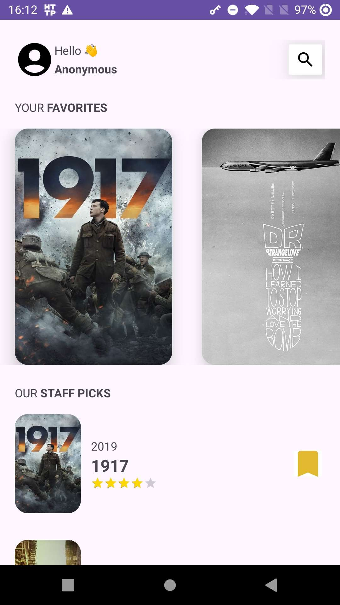

# Basic-Movie-App

A basic movie application which allows you to track your favorite movies. The data is sourced from local JSON files.

This project adheres to Android design and development best practices, such as:
- Clean Architecture
- Unit tests
- Kotlin flows and Coroutines

It serves a dual purpose: acting as a practical reference for the kind of applications the developer
can create, while also providing a platform to explore and implement new technologies.

## Features
As a user, you are able to:
  - search for a movie
  - see details of a movie, such as: title, revenue, budget, etc.
  - add a movie to your favorite list
  - view your favorite movies
  - able to see specially curated movies for your taste
  - 
## Screens

### Home Screen:

### Search Screen:

### Movie Detail Screen:

## Teck Stack

- Activity and Fragments with Views
- Navigation Component
- Kotlin
- MVVM
- Coroutines
- Flows
- Gson Serialization
- HILT
- JUnit4 for unit testing
